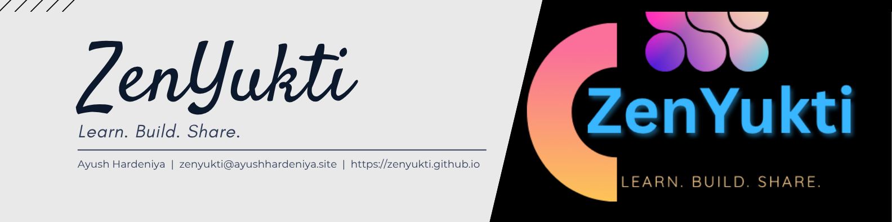

# ZenYukti

> *Learn. Build. Share.*

**ZenYukti** is a community-driven developer collective focused on building real-world solutions through open collaboration, creative projects, and active learning.

---

## 🚀 What We Do

- 🧠 **Learn** by solving problems & exploring new tools
- 🔧 **Build** creative and scalable tech projects
- 🔁 **Share** knowledge through collaboration, open-source, and mentorship

---

## 💡 Core Areas

- 💻 Web & App Development  
- ⚙️ Open Source Contributions  
- 🧪 Hackathons & Problem Solving  
- 🛠️ Real-World Project Experiments

---

## 🫱‍🫲 Join the Movement

Whether you're a beginner, creator, or explorer — ZenYukti welcomes you to the journey. We value curiosity, commitment, and community.

- 🌐 Website: [https://zenyukti.github.io](https://zenyukti.github.io)
- 📬 Email: [zenyukti@ayushhardeniya.site](mailto:zenyukti@ayushhardeniya.site)
- 💬 Discord: [Join the Server](https://discord.gg/9nWMSEfAtM)

---

## 📌 Quick Links

- [👥 Discussions](https://github.com/ZenYukti/community/discussions)
- [📂 Project Repositories](https://github.com/ZenYukti?tab=repositories)
- [📄 Contribute Guidelines](https://github.com/ZenYukti/.github/blob/main/CONTRIBUTING.md)

---

### 🫶 *“We don’t just code — we play it.”*  
ZenYukti • Crafted by minds that imagine more.

---

**👤 Founder & Authority**  
**Ayush Hardeniya**  
*(Legal Name: Ayush Sharma)*  
[Reach Out](https://ayushhardeniya.site)
