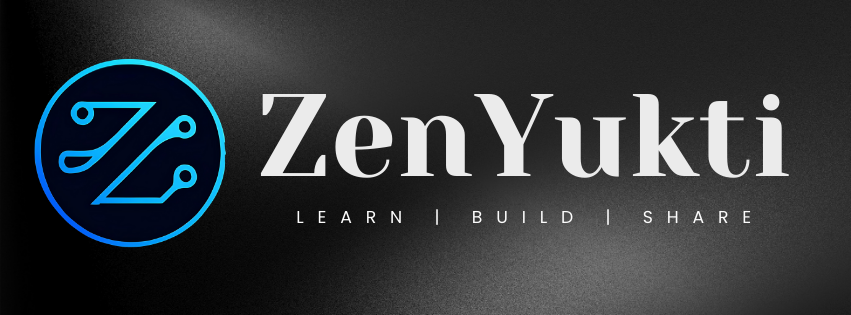

  
  
  <h3>Learn. Build. Share.</h3>
  <h4><i>To grow together.</i></h4>
  
  [Website](https://zenyukti.in) •
  [GitHub](https://github.com/ZenYukti) •
  [Discord](https://go.zenyukti.in/discord) •
  [LinkedIn](https://linkedin.com/company/zenyukti) •
  [X (Twitter)](https://x.com/zenyukti) •
  [Instagram](https://instagram.com/zenyukti)

## 🌟 About Us

**ZenYukti** is a **community-driven innovation hub** built on the values of collaboration, learning, and growth. We bring together creators, developers, and innovators to **Learn. Build. Share.** and grow as professionals while uplifting one another.

- **Mission:** To grow as a professional, inspiring community by building real-world projects, collaborating openly, and uplifting one another.
- **Motto:** *To grow together.*
- **Identity:** ZenYukti is not a student-only circle - it is a **community-led initiative** designed with professional scalability in mind.

## 🚀 What We Do

- 🤝 Collaborative problem-solving through initiatives like **ZenSolve**
- 🎙️ Knowledge-sharing via sessions, workshops, and **ZenTalks**
- 🛠️ Building and contributing to real-world projects
- 🌍 Creating an inclusive ecosystem for **professionals & learners alike**
- Taking real world initiatives for community approach and letting people grow all along.

## ✨ Core Values

- **Collaboration** → Build and grow together
- **Openness** → Share ideas and knowledge freely
- **Growth** → Inspire personal and professional development
- **Impact** → Work on meaningful projects

## 📌 Projects

Here is our featured project:

- [**ZenYukti Website**](https://github.com/ZenYukti/zenyukti.github.io) - Our community website built with React + Vite

## 🏆 Contribute

We welcome contributions from everyone! Check out our [contribution guidelines](https://github.com/ZenYukti/.github/blob/main/CONTRIBUTING.md) to get started.

Looking for a good first issue? Visit our [website repository](https://github.com/ZenYukti/zenyukti.github.io/issues) and look for issues labeled `good first issue`.

## 📬 Contact & Connect

- **Email:** [info@zenyukti.in](mailto:info@zenyukti.in)
- **Website:** [zenyukti.in](https://zenyukti.in)
- **Discord:** [Join our server](https://go.zenyukti.in/discord)
- **WhatsApp:** [Join our community](https://go.zenyukti.in/whatsapp)
- **X (Twitter):** [@zenyukti](https://x.com/zenyukti)
- **LinkedIn:** [ZenYukti](https://linkedin.com/company/zenyukti)
- **Instagram:** [@zenyukti](https://instagram.com/zenyukti)
- **Commudle:** [ZenYukti Community](https://www.commudle.com/communities/zenyukti)

---

  

